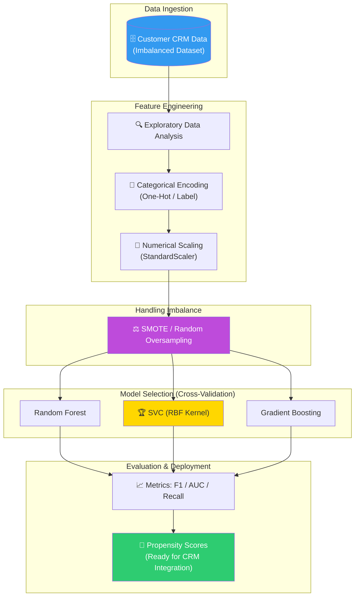
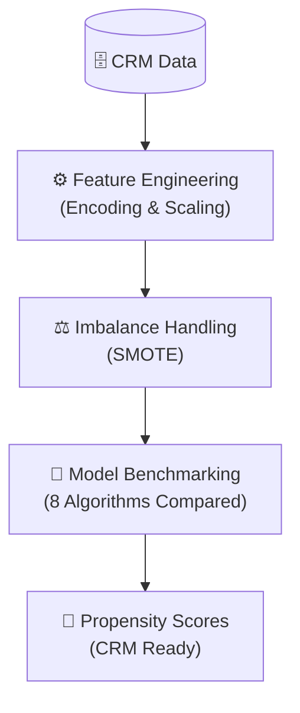

# 🏛️ InsurePredict: Enterprise Propensity Modeling & Cross-Sell Optimization

<p align="center">
  
  
  
  
  
</p>

**InsurePredict** è una soluzione di Predictive Analytics progettata per ottimizzare le strategie di cross-selling nel settore assicurativo. Attraverso l'implementazione di modelli di **Propensity Scoring**, il progetto identifica con alta precisione i clienti con la maggiore probabilità di sottoscrivere nuove polizze, permettendo una segmentazione mirata delle campagne di marketing e un incremento misurabile del Customer Lifetime Value (CLV).

## 🏢 Valore Enterprise & Settori di Applicazione

| Settore / Ambito | Rilevanza & Benefici |
|-------------------|-----------|
| **Insurance & Financial Services** | Ottimizzazione delle campagne di cross-sell e up-sell, riducendo i costi di acquisizione (CAC) e migliorando il tasso di conversione. |
| **Banking & Fintech** | Credit Scoring e Propensity Modeling per la vendita di prodotti finanziari correlati (prestiti, carte di credito, investimenti). |
| **E-commerce & Retail** | Sistemi di raccomandazione basati sulla propensione all'acquisto per categorie di prodotto specifiche. |
| **Customer Retention (Churn)** | Applicazione di tecniche simili per prevedere l'abbandono dei clienti e implementare strategie di retention proattive. |

---

## 🎯 Executive Summary & Valore di Business
InsurePredict risolve la sfida dell'allocazione inefficiente delle risorse di vendita, puntando esclusivamente sui lead con il più alto potenziale di conversione.

### 🏛️ 1. Gestione Professionale del Class Imbalance
* **Problematica Enterprise:** Nel cross-selling, la classe positiva (chi acquista) è spesso una piccola frazione del totale. Un modello standard ignorerebbe questa minoranza.
* **Soluzione Tecnica:** Implementazione di tecniche avanzate di oversampling (**SMOTE**) combinate con **Class Weighting** strategico, garantendo che il modello impari correttamente i pattern distintivi dei clienti "propensi" nonostante la scarsità di dati.

### 🤖 2. Benchmarking & Model Selection Rigorosa
* **Confronto di 8 Algoritmi:** Valutazione sistematica di diverse architetture (Random Forest, Gradient Boosting, SVC, Logistic Regression, ecc.) per identificare il miglior predittore.
* **Winner Model (SVC RBF):** La selezione di Support Vector Classification con kernel RBF ha permesso di catturare relazioni non lineari complesse tra le feature demografiche e comportamentali del cliente.

### ⚙️ 3. Feature Engineering & Scaling
* **Preprocessing Pipeline:** Trasformazione di variabili categoriche e scaling numerico (`StandardScaler`) per garantire la convergenza degli algoritmi basati sulla distanza.
* **Interpretazione dei Risultati:** Analisi delle matrici di confusione e dell'F1-Score per bilanciare correttamente Precision (evitare spam verso clienti non interessati) e Recall (non perdere opportunità di vendita).

---

## 🏗️ Architettura della Pipeline Predittiva



## 🛠️ Stack Tecnologico

| Layer | Tecnologia | Ruolo |
|:------|:-----------|:-----|
| 🐍 **Language** | Python 3.8+ | Core development |
| 🤖 **ML Framework** | scikit-learn | Model training & Selection |
| ⚖️ **Imbalance Management** | imbalanced-learn | Oversampling (SMOTE) |
| 📊 **Analysis** | pandas / NumPy | Data manipulation |
| 📈 **Visualization** | Seaborn / Matplotlib | Insights & Evaluation |

## 🚀 Setup

```bash
# Clone
git clone https://github.com/sylver86/09-insurance-cross-sell-prediction-scikit-learn.git
cd 09-insurance-cross-sell-prediction-scikit-learn

# Install
pip install -r requirements.txt

# Esplorazione Pipeline
jupyter notebook "notebooks/Progetto Machine Learning.ipynb"
```

<br><br>

*Progettato e sviluppato da Eugenio Pasqua.*

---

# 🇬🇧 ENGLISH VERSION

# 🏛️ InsurePredict: Enterprise Propensity Modeling & Cross-Sell Optimization

<p align="center">
  
  
  
</p>

**InsurePredict** is a Predictive Analytics solution designed to optimize cross-selling strategies in the insurance sector. By implementing **Propensity Scoring** models, the project identifies with high precision the customers most likely to sign up for new policies, allowing for targeted campaign segmentation and a measurable increase in Customer Lifetime Value (CLV).

## 🏢 Enterprise Value & Application Sectors

| Sector / Domain | Relevance & Benefits |
|-------------------|-----------|
| **Insurance & Finance** | Cross-sell and up-sell campaign optimization, reducing Customer Acquisition Cost (CAC). |
| **Banking & Fintech** | Credit Scoring and Propensity Modeling for related financial products. |
| **CRM & Marketing** | Propensity scoring to drive high-conversion outbound campaigns. |

---

## 🏗️ Predictive Pipeline Architecture



## 🧰 Technology Stack

`Python 3.8+` · `scikit-learn` · `imbalanced-learn (SMOTE)` · `pandas` · `NumPy`

<br><br>

*Designed and developed by Eugenio Pasqua.*
